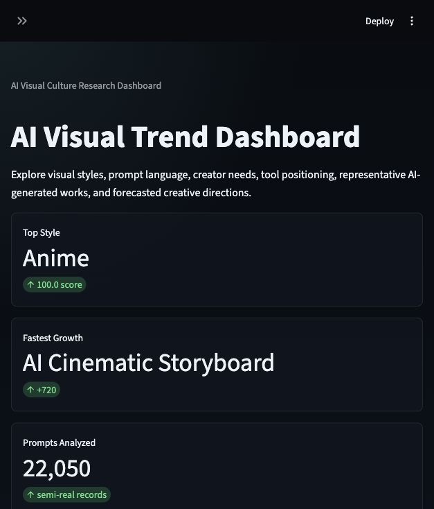
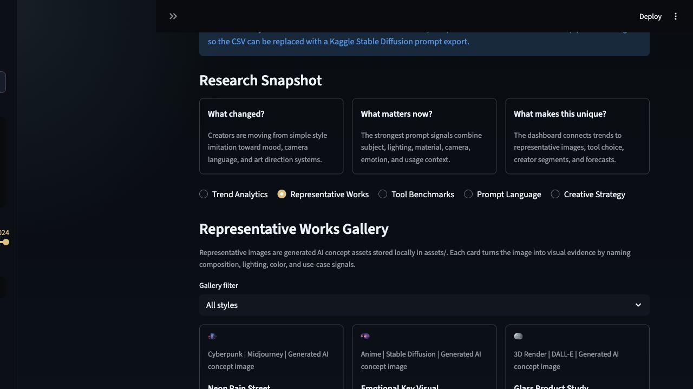

# AI Visual Trend Dashboard

An interactive Streamlit dashboard for exploring AI-generated visual culture through prompt trends, tool benchmarks, representative AI-generated works, keyword signals, and simple 2025-2027 trend forecasts.

## Key Insight

Anime-style prompt signals show the strongest 2024 sample volume, while Cyberpunk remains highly competitive through lighting and atmosphere keywords. AI Cinematic Storyboard and Documentary Realism are emerging signals, suggesting AI visual culture is moving from pure aesthetic imitation toward believable narrative and video-oriented image-making.

The dashboard supports this insight by connecting normalized prompt counts, keyword growth, representative AI-generated images, tool benchmarks, and exploratory linear forecasts.

## Live Demo

Local development URL:

```bash
http://localhost:8501
```

When deployed, add your Streamlit Cloud URL here:

```text
https://your-app-name.streamlit.app
```

## Screenshot

Main dashboard preview:



Representative works preview:



## How To Run

Install dependencies:

```bash
pip install -r requirements.txt
```

Run the app:

```bash
streamlit run app.py
```

If port 8501 is busy:

```bash
streamlit run app.py --server.port 8510
```

## Data Source

Current project data lives in:

- `data/prompt_trend_signals.csv`
- `data/tool_benchmarks.csv`
- `data/representative_works.csv`
- `data/real_world_references.csv`

The included prompt dataset is a semi-real aggregate built from public Stable Diffusion prompt dataset structures, Lexica-style gallery tags, and AI tool category patterns. It is designed to match a real Kaggle workflow while keeping the project self-contained.

Data boundary:

```text
Current data: structured semi-real demonstration dataset
Final data path: replace the CSV with a Kaggle Stable Diffusion prompt export or your own prompt log
```

Recommended final replacement source:

- [Stable-Diffusion-Prompts on Kaggle](https://www.kaggle.com/datasets/thedevastator/gustavosta-nlp-research-prompts/data)
- [900k Diffusion Prompts Dataset on Kaggle](https://www.kaggle.com/datasets/tanreinama/900k-diffusion-prompts-dataset)
- Lexica-style public prompt gallery exports
- Public AI tool documentation and changelogs
- Your own prompt logs or survey data

Data cleaning and aggregation:

- Duplicate keyword groups removed
- Unsafe categories excluded
- Visual style labels normalized
- Prompt records grouped by year, style, tool, keyword, and intent
- Prompt counts normalized into popularity scores

Total analyzed prompt signals in the included CSV:

```text
22,050
```

## Features

- Cached CSV data loading with `st.cache_data`
- Sidebar filters for style, year, tool, and recommendation priority
- Random exploration button for live demos
- Homepage AI Toolchain Snapshot showing where each tool fits in the production workflow
- Plotly chart selection with click drill-down
- Linked tool filter for radar chart and keyword analysis
- Representative AI-generated work gallery using local image assets and visual evidence captions
- Use Case Recommendation for brand campaigns, game concepts, social visuals, short film moodboards, and product renders
- Motion Preview GIFs for cinematic, editorial, and luxury use cases
- Real-World References page with official tool links and trend evidence notes
- Stable prompt text area for copying generated creative directions
- Moodboard preview based on selected visual styles
- Exploratory linear forecast for 2025-2027 with uncertainty interval
- Friendly error handling for missing or invalid CSV files

## Visual Style Coverage

The dashboard tracks 10 AI visual styles:

- Cyberpunk
- Anime
- 3D Render
- Retro Futurism
- Minimalism
- Dark Fantasy
- Documentary Realism
- Surreal Editorial
- Luxury Fashion
- AI Cinematic Storyboard

## Tech Stack

- Python
- Streamlit
- Pandas
- Plotly
- NumPy
- scikit-learn
- AI-generated local image assets

## Deployment Notes

For Streamlit Cloud:

1. Push this project to GitHub.
2. Make sure `requirements.txt`, `app.py`, `data/`, and `assets/` are committed.
3. Create a new Streamlit Cloud app from the GitHub repository.
4. Set the main file path to `app.py`.
5. Add the public app URL to the top of this README.

## Demo Video Plan

Record a 1-2 minute Loom or OBS video:

1. Show the dashboard hero metrics and data volume.
2. Use the sidebar filters.
3. Click a trend chart point to show drill-down details.
4. Open Representative Works and explain why images support the trends.
5. Use Random Explore.
6. Show Use Case Recommendation and Motion Preview.
7. Open Real References to show official research links.
8. Copy a creative direction prompt.
9. Show the forecast chart.

## Suggested Presentation Insight

Example insight for a defense slide:

> Anime has the strongest 2024 prompt volume in the included signal dataset, while AI Cinematic Storyboard and Documentary Realism show strong emerging growth. This suggests prompt culture is shifting from static style imitation toward narrative, video-oriented, and believable visual storytelling.

How it was found:

- Prompt counts were grouped by `year` and `style`.
- Each style was normalized into a popularity score.
- 2024 style rankings were compared against keyword growth signals.
